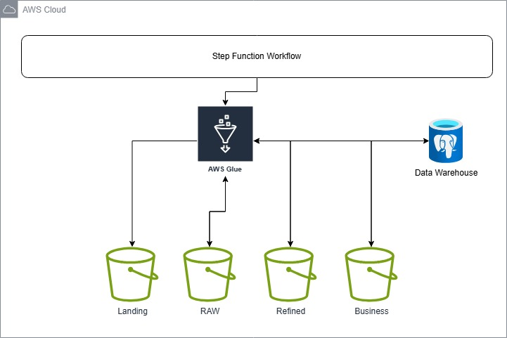
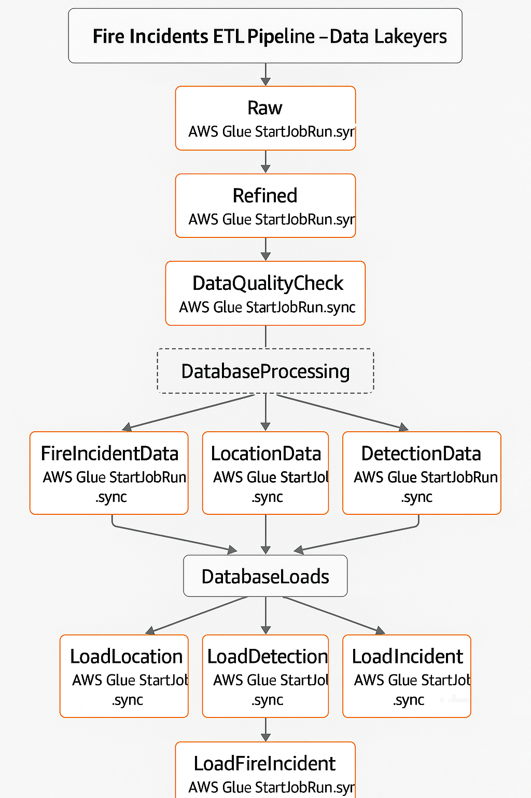
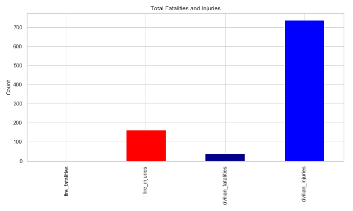
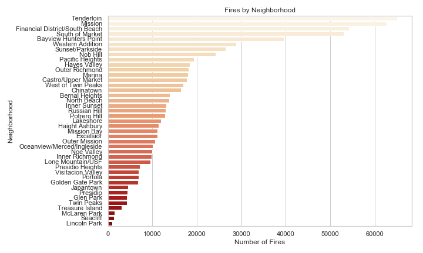
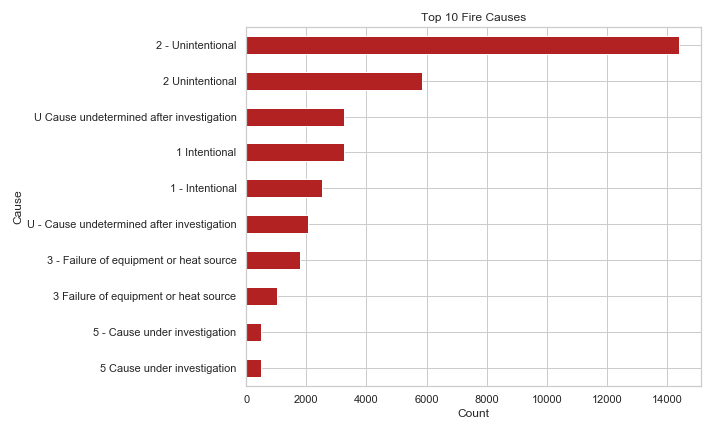
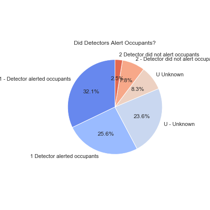
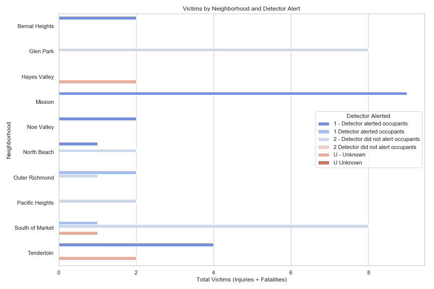

# Fire Incidents Data Warehouse Project

This project deploys an AWS-based data pipeline to manage and analyze fire incident information for San Francisco. It automates the ingestion, transformation, and storage of data in S3 and PostgreSQL, orchestrated by AWS Step Functions. The pipeline provides insights into fire incidents, including causes, locations, and safety outcomes.


## Deploying the AWS Infrastructure

### Pre-deployment instructions:
- Set up your AWS account.
- **Provision the following AWS resources:**
  - **S3 Buckets:** For landing, raw, refined, and business zones
    - *IAM permissions required:* `s3:CreateBucket`, `s3:PutObject`, `s3:GetObject`, `s3:ListBucket`, `s3:DeleteObject`
  - **AWS Glue:**
    - Glue connections for PostgreSQL (JDBC)
    - *IAM permissions required:* `glue:*` (for jobs, connections, crawlers), `s3:*` (for reading/writing data), `secretsmanager:GetSecretValue`, `rds-db:connect`, `cloudwatch:PutLogEvents`, `cloudwatch:CreateLogGroup`, `cloudwatch:CreateLogStream`
    - IAM role for Glue with permissions for S3, Secrets Manager, RDS, CloudWatch
  - **AWS Step Functions:**
    - *IAM permissions required:* `states:CreateStateMachine`, `states:StartExecution`, `states:DescribeStateMachine`, `glue:StartJobRun`, `cloudwatch:PutLogEvents`, `cloudwatch:CreateLogGroup`, `cloudwatch:CreateLogStream`
    - IAM role for Step Functions with permissions to trigger Glue jobs
  - **AWS Secrets Manager:**
    - Secrets for PostgreSQL (`fire-incidents/postgres`) containing all required database connection parameters as referenced in the configuration.
    - Secrets for S3 (`fire-incidents/s3`) containing all required bucket names and the AWS region as referenced in the configuration.
    - *IAM permissions required:* `secretsmanager:CreateSecret`, `secretsmanager:GetSecretValue`, `secretsmanager:DescribeSecret`, `secretsmanager:ListSecrets`
  - **Amazon RDS (PostgreSQL):**
    - Database instance accessible from Glue jobs (correct VPC/subnet/SG setup)
    - Schema/tables created using `sql/create_tables.sql`
    - *IAM permissions required:* `rds:CreateDBInstance`, `rds:DescribeDBInstances`, `rds:DeleteDBInstance`, `rds:ModifyDBInstance`, `rds-db:connect`
  - **Networking:**
    - VPC, subnets, and security groups to allow Glue <-> RDS connectivity
    - *IAM permissions required:* `ec2:CreateVpc`, `ec2:CreateSubnet`, `ec2:CreateSecurityGroup`, `ec2:AuthorizeSecurityGroupIngress`, `ec2:CreateVpcEndpoint`, `ec2:Describe*`

### Deploying the Pipeline
- Create S3 buckets:
  - Landing zone bucket (for raw CSV files)
  - Raw zone bucket (for initial processed data)
  - Refined zone bucket (for cleaned/standardized data)
  - Business zone bucket (for dimensional model data)
- Upload the daily fire incidents CSV to your S3 landing zone bucket (e.g., `s3://your-bucket/landing/incident_date={yyyy-mm-dd}/`).
- Create AWS Glue jobs for each ETL/business/load script (`src/etl/raw.py`, `src/etl/refined.py`, `src/etl/business/*.py`, `src/loads/*.py`, `src/utils/data_quality.py`).
- Use the Step Function definition in `src/aws/aws_step_function_definition.json` to orchestrate the workflow.
- Ensure IAM roles for Glue and Step Functions have permissions for S3, Secrets Manager, and RDS.
- Trigger the Step Function or run jobs manually for a given date partition.

## Architecture

The architecture is designed to support a robust, scalable, and automated data pipeline for fire incident analytics. Data ingestion begins with the upload of daily CSV files to an S3 landing zone. The pipeline then processes the data through multiple S3 layers (landing, raw, refined, and business), using AWS Glue jobs for extraction, transformation, and loading (ETL). Orchestration is handled by AWS Step Functions, which coordinate the execution of each ETL stage. The final, curated data is loaded into a PostgreSQL data warehouse, ready for analytical queries and BI reporting.


*Overall AWS-based data pipeline architecture for the Fire Incidents Data Warehouse project.*

The architecture is structured as follows: outside the AWS context, a Python script uploads the source CSV file to S3 (landing layer). The AWS environment includes S3 (raw, refined, business zones), Glue jobs for ETL, Step Functions for orchestration, and PostgreSQL for the data warehouse.

## Workflow

The workflow is orchestrated by AWS Step Functions, which trigger Glue jobs in the correct sequence for each ETL stage. This ensures data is processed, transformed, and loaded efficiently from the landing zone to the data warehouse.


*Step Function workflow orchestrating the ETL pipeline steps in AWS.*

## Project Structure
```
src/
├── aws/                    # AWS Step Functions definition
├── config/                 # Configuration files (uses AWS Secrets Manager)
├── etl/                    # ETL scripts
│   ├── raw.py             # Raw data processing (deduplication, initial cleaning)
│   ├── refined.py         # Refined data processing (standardization, date parsing)
│   └── business/          # Business layer scripts (dimension/fact transformations)
│       ├── detection_data.py  # Detection dimension business layer
│       ├── incident_data.py   # Incident dimension business layer
│       ├── location_data.py   # Location dimension business layer
│       └── fire_incident_data.py # Fact table business layer
├── loads/                  # Data loading scripts (to PostgreSQL)
│   ├── load_detection.py  # Detection dimension loading
│   ├── load_incident.py   # Incident dimension loading
│   ├── load_location.py   # Location dimension loading
│   └── load_fire_incident.py # Fact table loading
└── utils/                 # Utility functions
    ├── data_quality.py    # Data quality checks
    └── logging_utils.py   # Logging setup

sql/
└── create_tables.sql      # Database schema definition
```

## Data Modeling Strategy

The data modeling approach for this project is based on the star schema design, with a central fact table and several dimension tables. This approach maximizes performance for analytical queries and BI dashboards.

### Dimensions
- **Location Dimension** (`dim_location`): incident_number, address, city, zipcode, supervisor_district, neighborhood_district, point
- **Detection Dimension** (`dim_detection`): incident_number, detector_alerted_occupants, detectors_present, detector_type, detector_operation, detector_effectiveness, detector_failure_reason, automatic_extinguishing_system_present, automatic_extinguishing_system_type, automatic_extinguishing_system_performance, automatic_extinguishing_system_failure_reason, number_of_sprinkler_heads_operating
- **Incident Dimension** (`dim_incident`): incident_number, primary_situation, property_use, area_of_fire_origin, ignition_cause, ignition_factor_primary, ignition_factor_secondary, heat_source, item_first_ignited, human_factors_associated_with_ignition, structure_type, structure_status, floor_of_fire_origin, fire_spread, no_flame_spread

### Fact Table
- **Fire Incident Fact** (`fact_fire_incident`): incident_number, incident_date, alarm_time, arrival_time, dispatch_time, turnout_time, suppression_time, suppression_units, suppression_personnel, ems_units, ems_personnel, other_units, other_personnel, estimated_property_loss, estimated_contents_loss, fire_fatalities, fire_injuries, civilian_fatalities, civilian_injuries, floors_minimum_damage, floors_significant_damage, floors_heavy_damage, floors_extreme_damage, detector_alerted_occupants, detectors_present, automatic_extinguishing_system_present, number_of_sprinkler_heads_operating

## ETL Pipeline Workflow

1. **Raw Layer** (`raw.py`):
   - Ingests CSV from S3 landing zone
   - Deduplicates and writes to Parquet in the raw zone
2. **Refined Layer** (`refined.py`):
   - Cleans and standardizes data, trims fields, ensures date formats
   - Writes to Parquet in the refined zone
3. **Business Layer** (`etl/business/*.py`):
   - Each business script selects and transforms the relevant fields for its dimension/fact
   - Writes partitioned Parquet files to the business zone
4. **Loaders** (`loads/*.py`):
   - Each loader reads from the business zone and loads data into the corresponding PostgreSQL table
   - Uses upsert logic, batching, and partitioning by date

### Monitoring
- The pipeline logs each step and status to CloudWatch and PostgreSQL.
- Data quality checks are implemented in `src/utils/data_quality.py` and include:
  - Null value checks
  - Data type validation
  - Unique key checks
  - Date format validation
  - Numeric range checks
  - Boolean consistency checks

## Example Analytical Queries & Visualizations

Here are some example queries you can run on the PostgreSQL data warehouse, each followed by a sample visualization generated from the data:

### Fire Incidents by Week
```sql
SELECT date_trunc('week', incident_date) AS week_start, COUNT(*) AS total_incidents
FROM fact_fire_incident
GROUP BY week_start
ORDER BY week_start;
```

*Visualizes the number of fatalities and injuries in fire incidents, helping to identify trends and areas for safety improvement.*

### Top Neighborhoods by Fire Incidents
```sql
SELECT neighborhood_district, COUNT(*) AS incident_count
FROM dim_location
GROUP BY neighborhood_district
ORDER BY incident_count DESC
LIMIT 10;
```

*Maps the distribution of fire incidents across neighborhoods, useful for resource allocation and risk assessment.*

### Most Common Fire Causes
```sql
SELECT ignition_cause, COUNT(*) AS cause_count
FROM dim_incident
GROUP BY ignition_cause
ORDER BY cause_count DESC
LIMIT 5;
```

*Breaks down the main causes of fires, supporting targeted prevention strategies.*

### Detector Alerted Occupants (Pie Chart)
```sql
SELECT detector_alerted_occupants, COUNT(*) AS incident_count
FROM dim_detection
GROUP BY detector_alerted_occupants;
```
*Shows the proportion of incidents where detectors alerted occupants, providing insight into fire safety effectiveness.*



### Victims by Neighborhood and Detector
```sql
SELECT l.neighborhood_district, d.detector_alerted_occupants, 
       SUM(f.fire_fatalities + f.civilian_fatalities + f.fire_injuries + f.civilian_injuries) AS total_victims
FROM fact_fire_incident f
JOIN dim_location l ON f.incident_number = l.incident_number
JOIN dim_detection d ON f.incident_number = d.incident_number
GROUP BY l.neighborhood_district, d.detector_alerted_occupants
ORDER BY total_victims DESC;
```

*Shows the distribution of fire victims by neighborhood and whether detectors alerted occupants, helping to identify high-risk areas and the impact of detection systems.*

All these charts are produced using the data warehouse tables and can be reproduced.

## Assumptions and Notes
- Only the dimensions and fact tables present in the codebase are supported.
- All ETL and loader scripts are modular, with logging and error handling.
- Data is partitioned by date for efficient incremental loads.
- Credentials and configuration are externalized for security and flexibility.